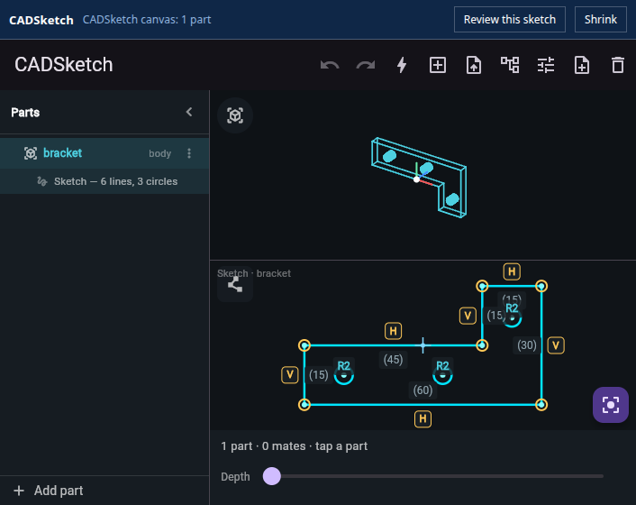

# CADSketch

Sketch-first CAD. Draw a rough shape and it snaps to clean, constrained,
dimensioned geometry, then extrudes to a 3D part you can add to, cut into,
assemble, and export.



| Where | How |
| --- | --- |
| iPhone and iPad | [App Store](https://apps.apple.com/us/app/cadsketch/id6783180350) |
| Any browser | [cadsketch.ai/app](https://cadsketch.ai/app/) |
| Codex and ChatGPT desktop | the plugin, below |

It is one codebase: a Flutter app with a C++ geometry kernel (native via FFI,
WebAssembly on the web). The plugin embeds the same web build.

## Use it inside Codex or ChatGPT

The plugin puts the editor in the app's sidebar, opens `.cadsketch` and `.dxf`
files from your workspace in it, and lets the agent work in the same sketch you
are looking at: read the canvas, move vertices, add holes, set driving
dimensions and constraints, undo, take a screenshot, and export STL.

Needs Node.js 18 or later and a recent Codex (tested with 0.157).

```sh
codex plugin marketplace add punkfab/cadsketch
codex plugin add cadsketch@cadsketch
```

Restart the desktop app, then click **CADSketch** in the sidebar, or ask:

> Create bracket.cadsketch for a 60 × 30 mm L-bracket, 5 mm thick, with three
> M4 holes, and open it.

Then, with it open: *"make it 95 mm wide and add a hole 8 mm in from each
corner."*

How it works, the tools, and the file format are in [mcp/README.md](mcp/README.md).
It is built on the open MCP Apps standard plus OpenAI's plugin extensions, so
the same server also works as a connector in Claude and other MCP hosts.

## What it does

- **Freehand to geometry.** Strokes are recognised as lines, arcs and circles,
  endpoints weld, and horizontal, vertical, parallel and perpendicular
  constraints are inferred.
- **Live constraint solving.** Tap a length and type a value; the sketch
  re-solves. Drag a point and the rest follows its constraints.
- **3D.** A closed profile extrudes to a solid. Sketch on a face to add material
  or cut into the part.
- **Assemblies.** Several parts, mate connectors on faces, fasten mates, and
  parameters shared across parts.
- **Import and export.** DXF, STL and OBJ in; STL and a
  [featuretree](https://github.com/punkfab/featuretree) IR out, which re-authors
  the part as an editable FreeCAD tree.

[GUIDE.md](GUIDE.md) is the user guide.

## Repository layout

```
native/        C++ geometry kernel behind a flat C ABI (line/circle fitting, the
               Levenberg-Marquardt constraint solver)
lib/
  sketch/      the sketch model, recognition, constraints, solids, import
  ui/          the 2D canvas, 3D views, parts tree
  export/      STL, mesh, featuretree IR
  ffi/         kernel bindings: dart:ffi natively, js_interop to WASM on the web
  mcp/         the bridge and editing commands used when embedded in an AI host
mcp/           the MCP server and the widget an AI host renders
plugin/        the Codex / ChatGPT plugin (built output committed) and the
               directory submission
landing/       cadsketch.ai
ios/ web/      platform shells
test/          the Dart test suite
```

Design rule: stable heavy math goes in the C++ kernel; tune-by-feel logic stays
in Dart, where hot reload makes tuning instant.

## Develop

```sh
./build_native.sh          # the kernel, for desktop runs and tests
flutter test               # the Dart suite
flutter run -d linux       # desktop harness
./build_wasm.sh && flutter build web --release --base-href /app/   # the web build

cd mcp && npm install && npm test    # the MCP server and plugin
```

Deployment (TestFlight, the website, the MCP server) is described in
[DEPLOY.md](DEPLOY.md) and [mcp/README.md](mcp/README.md).

## License

No license is granted. The source is published so you can read it and install
the plugin; all rights are reserved.

CADSketch is a [punkfab](https://punkfab.com) project.
